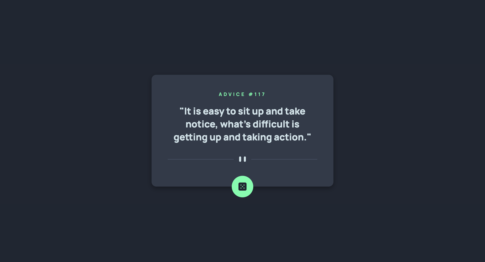

# Advice generator app 

This is a solution to the [Advice generator app challenge on Frontend Mentor](https://www.frontendmentor.io/challenges/advice-generator-app-QdUG-13db). Frontend Mentor challenges help you improve your coding skills by building realistic projects.

## Table of contents

- [Overview](#overview)
  - [The challenge](#the-challenge)
  - [Screenshot](#screenshot)
  - [Links](#links)
- [My process](#my-process)
  - [Built with](#built-with)
  - [What I learned](#what-i-learned)
  - [Continued development](#continued-development)
  - [Useful resources](#useful-resources)
- [Author](#author)

## Overview

### The challenge

Users should be able to:

- View the optimal layout for the app depending on their device's screen size
- See hover states for all interactive elements on the page
- Generate a new piece of advice by clicking the dice icon

### Screenshot

### Links

- [GitHub Repo](https://github.com/Aymmaann/Front-End-Development/tree/main/Advice%20generator%20app)
- [Live Site](https://fe-advice-generator-app.netlify.app/)

## My process

### Built with

- Semantic HTML5 markup
- CSS custom properties
- Flexbox
- JavaScript
- Fetch API

### What I learned

In this project, I learned how to structure a simple web application using HTML, CSS, and JavaScript. Specifically, I deepened my understanding of:

- Utilizing CSS custom properties (variables) to manage colors and styles consistently throughout the app.
- Implementing asynchronous JavaScript to fetch data from an API and update the DOM dynamically.
- Creating responsive layouts using CSS Flexbox and media queries to ensure the app looks good on all devices.

### Continued development

Moving forward, I plan to focus on the following areas to further enhance my skills:

- **Improving CSS organization:** Exploring methodologies like BEM (Block Element Modifier) for more scalable CSS architecture.
- **Enhancing JavaScript proficiency:** Practicing more complex JavaScript functionalities and exploring modern frameworks/libraries for larger-scale applications.
- **Accessibility:** Ensuring the application is fully accessible, including keyboard navigation and screen reader compatibility.

### Useful resources

- [MDN Web Docs](https://developer.mozilla.org/): Always a reliable source of information for web development.
- [CSS-Tricks](https://css-tricks.com/): Great for learning CSS techniques and best practices.
- [Frontend Mentor](https://www.frontendmentor.io/): Excellent for practicing frontend skills with realistic projects.

  
## Author

- Website - [My portfolio](https://ayman03-portfolio.netlify.app/)
- Frontend Mentor - [@Aymmaann](https://www.frontendmentor.io/profile/Aymmaann)

## Acknowledgments

I'd like to thank Frontend Mentor for providing such challenging projects to practice my skills. Also, a shoutout to the online coding communities for their support and valuable feedback.
