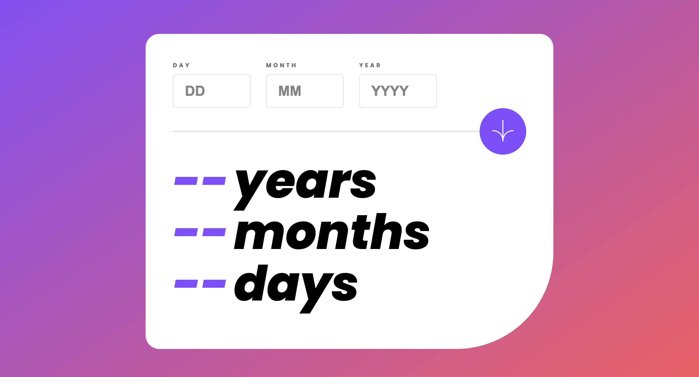

# Age Calculator App

This project is an Age Calculator App solution for the challenge provided by Frontend Mentor. The app calculates the age of a person based on the input of their birth date.

## Table of contents

- [Overview](#overview)
  - [The challenge](#the-challenge)
  - [Screenshot](#screenshot)
  - [Links](#links)
- [My process](#my-process)
  - [Built with](#built-with)
  - [What I learned](#what-i-learned)
  - [Continued development](#continued-development)
  - [Useful resources](#useful-resources)
- [Author](#author)
- [Acknowledgments](#acknowledgments)

## Overview

### The challenge

The challenge was to create an Age Calculator App that allows users to input their birth date and calculates their age in years, months, and days. The app should handle validation for empty fields, future dates, and invalid dates like February 30th.

### Screenshot

### Links

- [GitHib repo](https://github.com/Aymmaann/Front-End-Development/tree/main/Age%20calculator%20app)
- [Live Site]()

## My process

### Built with

- HTML5
- CSS3
- JavaScript

### What I learned

In this project, I learned how to handle form input validation using JavaScript. I also improved my CSS skills by working on layout and styling.

### Continued development

I plan to continue working on this project to add features such as animations for the age calculation result and improving the user interface for better usability.

### Useful resources

- [MDN Web Docs](https://developer.mozilla.org/) - This website provides comprehensive documentation for web technologies and helped me understand JavaScript concepts.
- [CSS-Tricks](https://css-tricks.com/) - This website has a lot of useful articles and tutorials on CSS, which helped me with styling and layout.

## Author

- Website - [My portfolio](https://ayman03-portfolio.netlify.app/)
- Frontend Mentor - [@Aymmaann](https://www.frontendmentor.io/profile/Aymmaann)

## Acknowledgments

I'd like to thank Frontend Mentor for providing such challenging projects to practice my skills. Also, a shoutout to the online coding communities for their support and valuable feedback.
