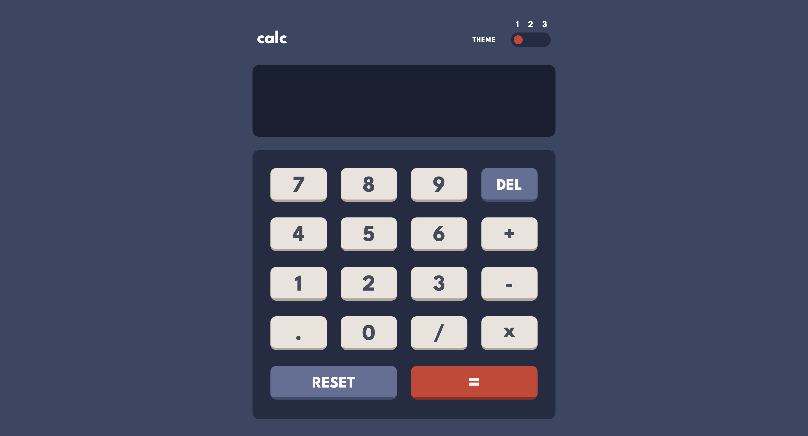
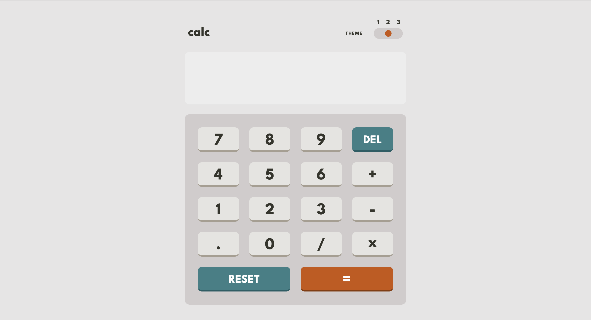
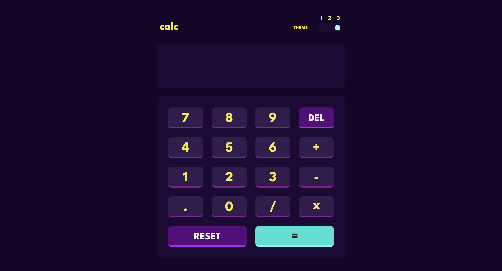

# Calculator app with Theme switcher

This is a solution to the [Calculator app challenge on Frontend Mentor](https://www.frontendmentor.io/challenges/calculator-app-9lteq5N29). Frontend Mentor challenges help you improve your coding skills by building realistic projects. 

## Table of contents

- [Overview](#overview)
  - [The challenge](#the-challenge)
  - [Screenshot](#screenshot)
  - [Links](#links)
- [My process](#my-process)
  - [Built with](#built-with)
  - [What I learned](#what-i-learned)
  - [Continued development](#continued-development)
  - [Useful resources](#useful-resources)
- [Author](#author)
- [Acknowledgments](#acknowledgments)

**Note: Delete this note and update the table of contents based on what sections you keep.**

## Overview

### The challenge

Users should be able to:

- See the size of the elements adjust based on their device's screen size
- Perform mathmatical operations like addition, subtraction, multiplication, and division
- Adjust the color theme based on their preference
- **Bonus**: Have their initial theme preference checked using `prefers-color-scheme` and have any additional changes saved in the browser

### Screenshot

### Links

- [GitHub repo](https://github.com/Aymmaann/Front-End-Development/tree/main/Calculator%20app%20with%20theme%20switcher)
- [Live Site](https://calc-with-themes.netlify.app)

## My process

### Built with

- Semantic HTML5 markup
- CSS custom properties
- Flexbox
- CSS Grid
- Mobile-first workflow
- Vanilla JavaScript

### What I Learned
During the development of my project, I have integrated several key functionalities using JavaScript and enhanced the user interface with CSS variables. Here are some key elements of the implementation:

- **Calculator Logic**: Developed essential calculator functionalities including resetting the calculator state, deleting the last entered character, checking for decimal input, and performing arithmetic operations (addition, subtraction, multiplication, and division) with error handling for display length.

- **Dynamic Theme Switching**: Implemented dynamic theme switching functionality using JavaScript and CSS variables. Based on the selected theme, adjusted background colors, text colors, and hover effects across the calculator interface.

### Continued Development
Moving forward, I plan to further optimize the user experience by refining UI interactions, ensuring cross-browser compatibility, and potentially integrating additional features such as history tracking or advanced mathematical operations.

### Useful resources

- [MDN Web Docs](https://developer.mozilla.org/) - Comprehensive web development documentation
- [Frontend Mentor](https://www.frontendmentor.io/challenges) - Platform for practicing frontend coding challenges
- [CSS Tricks](https://css-tricks.com/) - Helpful tips and tricks for CSS styling and layout

## Author

- Website - [My portfolio](https://ayman03-portfolio.netlify.app/)
- Frontend Mentor - [@Aymmaann](https://www.frontendmentor.io/profile/Aymmaann)

## Acknowledgements

 - [Awesome Readme Templates](https://awesomeopensource.com/project/elangosundar/awesome-README-templates)
 - [Awesome README](https://github.com/matiassingers/awesome-readme)
 - [How to write a Good readme](https://bulldogjob.com/news/449-how-to-write-a-good-readme-for-your-github-project)

