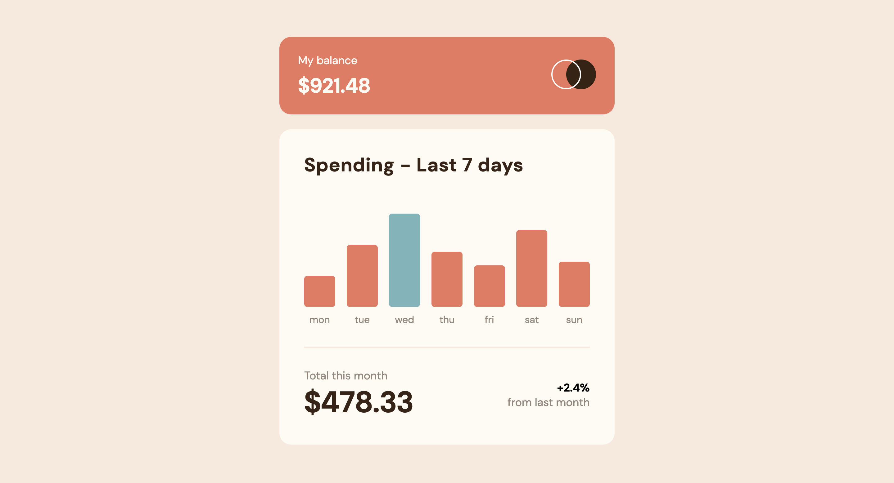

# Expenses chart component

This is a solution to the [Expenses chart component challenge on Frontend Mentor](https://www.frontendmentor.io/challenges/expenses-chart-component-e7yJBUdjwt). Frontend Mentor challenges help you improve your coding skills by building realistic projects.

## Table of contents

- [Overview](#overview)
  - [The challenge](#the-challenge)
  - [Screenshot](#screenshot)
  - [Links](#links)
- [My process](#my-process)
  - [Built with](#built-with)
  - [What I learned](#what-i-learned)
  - [Continued development](#continued-development)
  - [Useful resources](#useful-resources)
- [Author](#author)
- [Acknowledgments](#acknowledgments)

## Overview

### The challenge

Users should be able to:

- View the bar chart and hover over individual bars to see the correct amounts for each day
- See the current day’s bar highlighted in a different color from the other bars
- View the optimal layout for the content depending on their device’s screen size
- See hover states for all interactive elements on the page
- **Bonus**: Use the provided JSON data file to dynamically size the bars on the chart

### Screenshot

### Links

- [GitHub Repo](https://github.com/Aymmaann/Front-End-Development/tree/main/Expenses%20chart%20component)
- [Live Demo](https://expense-tracker-fe.netlify.app/)

## My process

### Built with

- Semantic HTML5 markup
- CSS custom properties
- Flexbox
- JavaScript (ES6+)
- Fetch API for data retrieval

### What I learned

During this project, I learned how to effectively use CSS for layout and styling, especially with regards to flexbox for responsive design. Implementing dynamic data binding using JavaScript taught me how to manage and update content dynamically based on user interactions and data changes.

### Continued development

In future projects, I aim to enhance my skills in handling asynchronous JavaScript operations more efficiently, such as error handling and data parsing. Additionally, exploring more advanced CSS techniques like CSS Grid for layout and CSS animations for interactive elements is on my learning roadmap.

### Useful resources

- [MDN Web Docs](https://developer.mozilla.org/) - Comprehensive web development documentation
- [Frontend Mentor](https://www.frontendmentor.io/challenges) - Platform for practicing frontend coding challenges
- [CSS Tricks](https://css-tricks.com/) - Helpful tips and tricks for CSS styling and layout

## Author

- Website - [My portfolio](https://ayman03-portfolio.netlify.app/)
- Frontend Mentor - [@Aymmaann](https://www.frontendmentor.io/profile/Aymmaann)

## Acknowledgments

I'd like to thank Frontend Mentor for providing such challenging projects to practice my skills. Also, a shoutout to the online coding communities for their support and valuable feedback.
