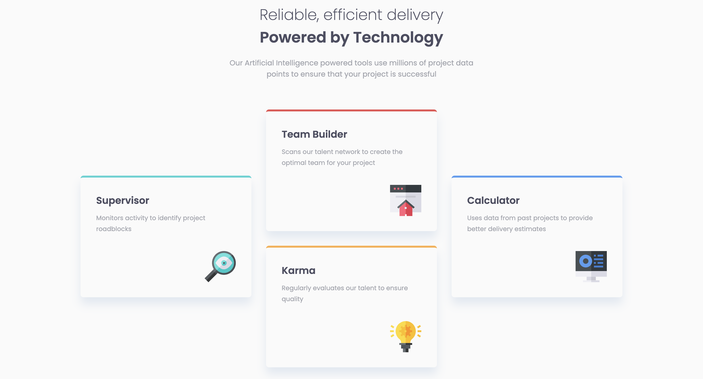

# Frontend Mentor - Four card feature section solution

This is a solution to the [Four card feature section challenge on Frontend Mentor](https://www.frontendmentor.io/challenges/four-card-feature-section-weK1eFYK). Frontend Mentor challenges help you improve your coding skills by building realistic projects. 

## Overview

### The challenge

Users should be able to:

- View the optimal layout for the site depending on their device's screen size

### Screenshot

### Links

- [GitHub repo](https://github.com/Aymmaann/Front-End-Development/tree/main/Four%20card%20feature%20section)
- [Live Site]([https://your-live-site-url.com](https://four-card-feature-section-fe.netlify.app/))

## My process

### Built with

- Semantic HTML5 markup
- CSS custom properties
- Flexbox
- CSS Grid
- Mobile-first workflow

### What I learned

In this project, I learned how to create a responsive layout using flexbox and media queries. I also gained more experience in styling elements with CSS and using CSS custom properties to define reusable variables.

### Continued development

In future projects, I want to further explore advanced CSS techniques like CSS Grid and animations. I also plan to deepen my understanding of JavaScript by learning more about ES6 features and modern frameworks like React.

### Useful resources

- [CSS Flexbox Guide](https://css-tricks.com/snippets/css/a-guide-to-flexbox/) - This guide helped me understand how to use flexbox for layout.
- [MDN Web Docs](https://developer.mozilla.org/en-US/docs/Web) - MDN is always a great resource for learning web development concepts and finding detailed documentation on HTML, CSS, and JavaScript.

## Author

- Website - [My portfolio](https://ayman03-portfolio.netlify.app/)
- Frontend Mentor - [@Aymmaann](https://www.frontendmentor.io/profile/Aymmaann)

## Acknowledgments

I'd like to thank Frontend Mentor for providing such challenging projects to practice my skills. Also, a shoutout to the online coding communities for their support and valuable feedback.
