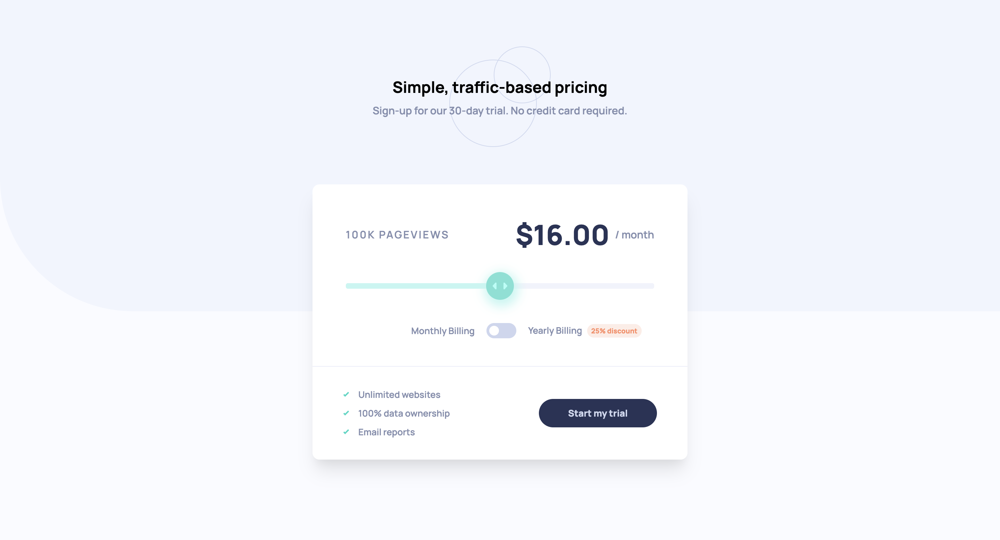

# Interactive Pricing Component 

This is a solution to the [Interactive pricing component challenge on Frontend Mentor](https://www.frontendmentor.io/challenges/interactive-pricing-component-t0m8PIyY8). Frontend Mentor challenges help you improve your coding skills by building realistic projects.

## Table of Contents

- [Overview](#overview)
  - [The Challenge](#the-challenge)
  - [Screenshot](#screenshot)
  - [Links](#links)
- [My Process](#my-process)
  - [Built With](#built-with)
  - [What I Learned](#what-i-learned)
  - [Continued Development](#continued-development)
  - [Useful Resources](#useful-resources)
- [Author](#author)

## Overview

### The Challenge

The challenge was to build an interactive pricing component where users can view different pricing options based on their selection of monthly or yearly billing. The component should also dynamically update based on the slider input for page views.

### Screenshot

### Links

- [GitHub repo](https://github.com/Aymmaann/Front-End-Development/tree/main/Interactive%20pricing%20component)
- [Live Site](https://fe-interactive-pricing-component.netlify.app/)

## My Process

### Built With

- Semantic HTML5 markup
- CSS custom properties
- Flexbox
- JavaScript

### What I Learned

During this project, I learned how to:

- Implement dynamic updates based on user interactions (slider input and toggle).
- Utilize media queries effectively for responsive design, adapting layouts for different screen sizes.
- Manage state in JavaScript to toggle between monthly and yearly billing options.
- Enhance accessibility by ensuring proper contrast ratios and semantic HTML structure.

### Continued Development

In future projects, I want to focus on:

- Improving my CSS skills, particularly in managing complex layouts and animations.
- Exploring frontend frameworks like React.js to streamline development and manage state more efficiently.
- Deepening my understanding of accessibility practices and implementing ARIA roles for better usability.

### Useful resources

- [MDN Web Docs](https://developer.mozilla.org/) - Comprehensive web development documentation
- [Frontend Mentor](https://www.frontendmentor.io/challenges) - Platform for practicing frontend coding challenges
- [CSS Tricks](https://css-tricks.com/) - Helpful tips and tricks for CSS styling and layout

## Author

- Website - [My portfolio](https://ayman03-portfolio.netlify.app/)
- Frontend Mentor - [@Aymmaann](https://www.frontendmentor.io/profile/Aymmaann)

## Acknowledgments

I'd like to thank Frontend Mentor for providing such challenging projects to practice my skills. Also, a shoutout to the online coding communities for their support and valuable feedback.
