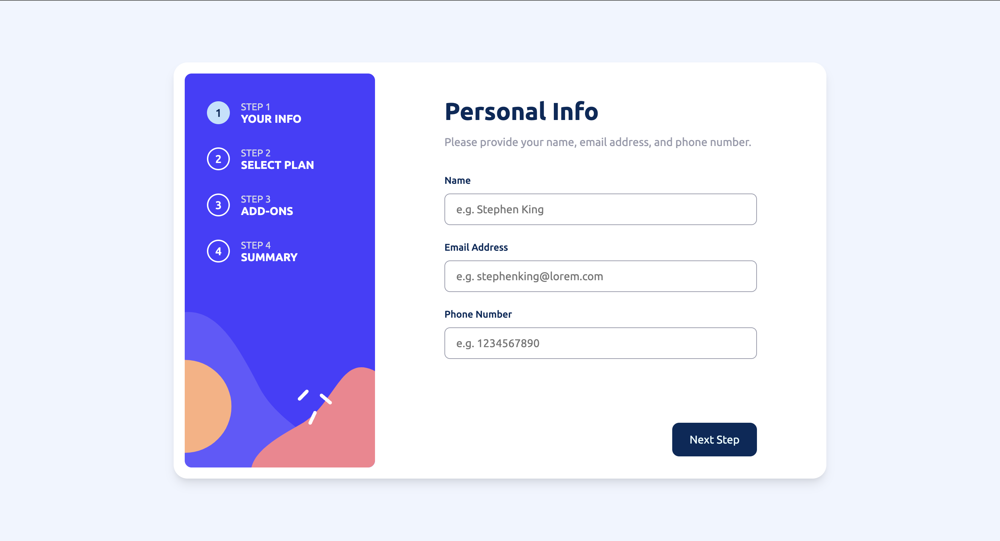
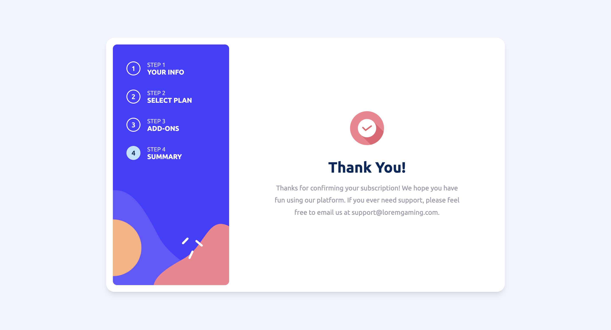

# Multi-step form 

This is a solution to the [Multi-step form challenge on Frontend Mentor](https://www.frontendmentor.io/challenges/multistep-form-YVAnSdqQBJ). Frontend Mentor challenges help you improve your coding skills by building realistic projects. 

## Table of contents

- [Overview](#overview)
  - [The challenge](#the-challenge)
  - [Screenshot](#screenshot)
  - [Links](#links)
- [My process](#my-process)
  - [Built with](#built-with)
  - [What I learned](#what-i-learned)
  - [Continued development](#continued-development)
  - [Useful resources](#useful-resources)
- [Author](#author)
- [Acknowledgments](#acknowledgments)

## Overview

### The challenge

Users should be able to:

- Complete each step of the sequence
- Go back to a previous step to update their selections
- See a summary of their selections on the final step and confirm their order
- View the optimal layout for the interface depending on their device's screen size
- See hover and focus states for all interactive elements on the page
- Receive form validation messages if:
  - A field has been missed
  - The email address is not formatted correctly
  - A step is submitted, but no selection has been made

### Screenshot

### Links

- [GitHub repo](https://github.com/Aymmaann/Front-End-Development/tree/main/Multi-step%20form)
- [Live Site](https://fe-multi-step-form.netlify.app)

## My process

### Built with

- Semantic HTML5 markup
- CSS custom properties
- Flexbox
- CSS Grid
- Mobile-first workflow
- Vanilla JavaScript

### What I Learned
During the development of my project, I have integrated several key functionalities using JavaScript and enhanced the user interface with CSS variables. Here are some key elements of the implementation:

- **JavaScript Interactivity**: Through JavaScript, I implemented interactivity for the form, handling user input validation, step navigation, and dynamic content updates based on user selections (like plan type and add-ons). Event listeners and DOM manipulation were utilized to achieve this functionality seamlessly.

- **CSS Styling and Responsive Design**: I gained experience in styling with CSS, including custom properties (--variables) for consistent theming across the form. Media queries were used to ensure responsiveness across various device sizes, adapting layout and content presentation accordingly.

### Continued Development
Moving forward, I plan to further refine user interaction and design enhancements for better usability and visual appeal. Implementing feedback loops from user testing will help optimize form validation and error messaging further. Additionally, exploring accessibility improvements and ensuring seamless responsiveness across all devices will enhance overall user experience. Continual code refactoring and optimization will also be pursued to maintain performance and scalability as the project evolves.

### Useful resources

- [MDN Web Docs](https://developer.mozilla.org/) - Comprehensive web development documentation
- [Frontend Mentor](https://www.frontendmentor.io/challenges) - Platform for practicing frontend coding challenges
- [CSS Tricks](https://css-tricks.com/) - Helpful tips and tricks for CSS styling and layout

## Author

- Website - [My portfolio](https://ayman03-portfolio.netlify.app/)
- Frontend Mentor - [@Aymmaann](https://www.frontendmentor.io/profile/Aymmaann)

## Acknowledgements

 - [Awesome Readme Templates](https://awesomeopensource.com/project/elangosundar/awesome-README-templates)
 - [Awesome README](https://github.com/matiassingers/awesome-readme)
 - [How to write a Good readme](https://bulldogjob.com/news/449-how-to-write-a-good-readme-for-your-github-project)

