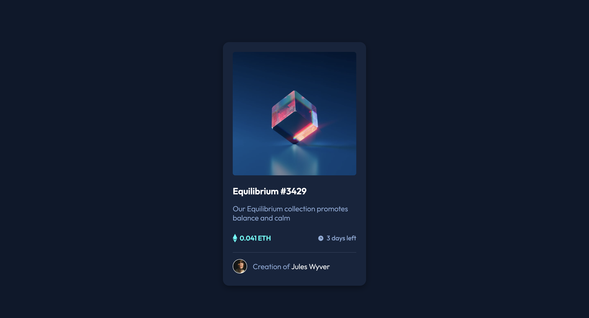

# NFT preview card component 

This is a solution to the [NFT preview card component challenge on Frontend Mentor](https://www.frontendmentor.io/challenges/nft-preview-card-component-SbdUL_w0U). Frontend Mentor challenges help you improve your coding skills by building realistic projects. 

## Table of contents

- [Overview](#overview)
  - [The challenge](#the-challenge)
  - [Screenshot](#screenshot)
  - [Links](#links)
- [My process](#my-process)
  - [Built with](#built-with)
  - [What I learned](#what-i-learned)
  - [Continued development](#continued-development)
  - [Useful resources](#useful-resources)
- [Author](#author)
- [Acknowledgments](#acknowledgments)

## Overview

### The challenge

Users should be able to:

- View the optimal layout depending on their device's screen size
- See hover states for interactive elements

### Screenshot

### Links

- [Solution URL](https://github.com/Aymmaann/Front-End-Development/tree/main/NFT%20preview%20card%20component)
- [Live Site URL](https://nft-preview-fe.netlify.app/)

## My process

### Built with

- Semantic HTML5 markup
- CSS custom properties
- Flexbox
- CSS Grid
- Mobile-first workflow

### What I learned

Through this project, I deepened my understanding of modern CSS techniques, particularly in creating responsive and visually appealing web components. One of the main learnings was how to effectively utilize CSS Flexbox and Grid to achieve flexible and adaptive layouts across different screen sizes.

Overall, this project provided a valuable opportunity to apply and reinforce my front-end development skills, from HTML structure to CSS styling and layout techniques. It also encouraged me to explore new approaches and continuously improve as a web developer.

### Continued development

I want to continue focusing on improving my CSS skills, especially in the areas of layout and responsiveness.

## Author

- Website - [My portfolio](https://ayman03-portfolio.netlify.app/)
- Frontend Mentor - [@Aymmaann](https://www.frontendmentor.io/profile/Aymmaann)

## Acknowledgments

I'd like to thank Frontend Mentor for providing such challenging projects to practice my skills. Also, a shoutout to the online coding communities for their support and valuable feedback.

