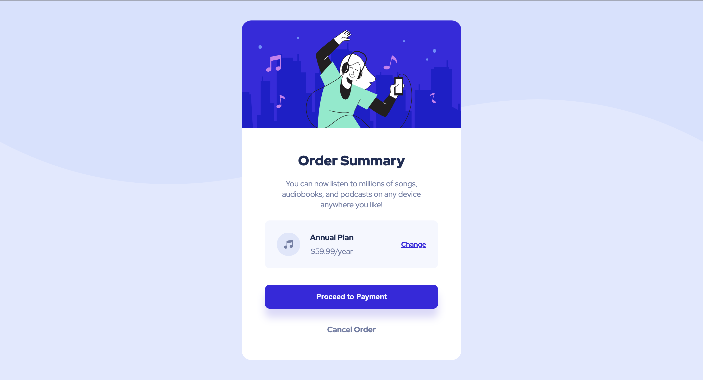

# Order summary card

This is a solution to the [Order summary card challenge on Frontend Mentor](https://www.frontendmentor.io/challenges/order-summary-component-QlPmajDUj). Frontend Mentor challenges help you improve your coding skills by building realistic projects.

## Overview

### The challenge

Users should be able to:

- See hover states for interactive elements

### Screenshot

### Links

- [GitHub repo](https://github.com/Aymmaann/Front-End-Development/tree/main/Order%20summary%20component/images)
- [Live Site](https://music-plan-component.netlify.app/)

## My process

### Built with

- Semantic HTML5 markup
- CSS custom properties
- Flexbox
- Responsive design
- [Google Fonts](https://fonts.google.com/) - For font styles

### What I learned

Through this project, I gained practical experience in crafting responsive and visually appealing web components using modern HTML and CSS techniques. Some of the key learnings include:

- Implementing hover states and transitions for interactive elements to enhance user experience.
- Utilizing Flexbox for flexible layout structures and alignment of elements.
- Employing CSS custom properties for efficient management of design variables and theming.
- Enhancing accessibility by utilizing semantic HTML elements and proper alt attributes for images.
- Optimizing images for web use to improve performance and loading times.

### Continued development

While completing this project, I identified areas for further improvement and exploration, including:

- Exploring advanced CSS techniques such as CSS Grid for more complex layout structures.
- Enhancing interactivity and user engagement through JavaScript interactions and animations.
- Learning about modern front-end frameworks like React or Vue.js to streamline development processes and improve maintainability.

### Useful resources

- [MDN Web Docs](https://developer.mozilla.org/) - Comprehensive web development documentation and tutorials.
- [CSS-Tricks](https://css-tricks.com/) - Helpful articles and guides on CSS techniques and best practices.
- [Frontend Mentor](https://www.frontendmentor.io/) - Platform for practicing front-end coding skills with real-world projects and challenges.

### Continued development

I want to continue focusing on improving my CSS skills, especially in the areas of layout and responsiveness.

## Author

- Website - [My portfolio](https://ayman03-portfolio.netlify.app/)
- Frontend Mentor - [@Aymmaann](https://www.frontendmentor.io/profile/Aymmaann)

## Acknowledgments

I'd like to thank Frontend Mentor for providing such challenging projects to practice my skills. Also, a shoutout to the online coding communities for their support and valuable feedback.

