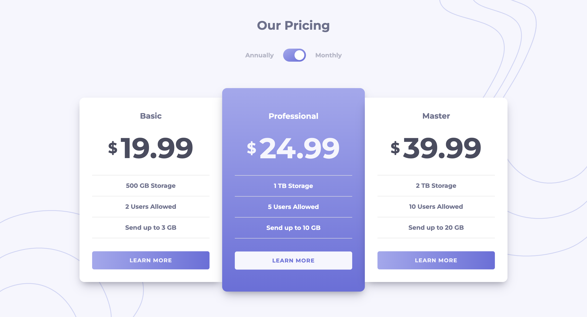

# Pricing component with toggle 

This is a solution to the [Pricing component with toggle challenge on Frontend Mentor](https://www.frontendmentor.io/challenges/pricing-component-with-toggle-8vPwRMIC). Frontend Mentor challenges help you improve your coding skills by building realistic projects.

## Table of contents

- [Overview](#overview)
  - [The challenge](#the-challenge)
  - [Screenshot](#screenshot)
  - [Links](#links)
- [My process](#my-process)
  - [Built with](#built-with)
  - [What I learned](#what-i-learned)
  - [Continued development](#continued-development)
  - [Useful resources](#useful-resources)
- [Author](#author)

## Overview

### The challenge

Users should be able to:

- View the optimal layout for the component depending on their device's screen size
- Control the toggle with both their mouse/trackpad and their keyboard
- **Bonus**: Complete the challenge with just HTML and CSS

### Screenshot

### Links

- [GitHub repo](https://github.com/Aymmaann/Front-End-Development/tree/main/Pricing%20component%20with%20toggle)
- [Live Site](https://pricing-component-fe.netlify.app/)

## My process

### Built with

- Semantic HTML5 markup
- CSS custom properties
- Flexbox
- Media queries
- JavaScript

### What I learned

During this project, I deepened my understanding of:

- **CSS Flexbox**: Utilized for responsive layout and alignment of pricing cards.
- **CSS Custom Properties**: Employed to manage consistent color schemes throughout the design.
- **Media Queries**: Used to create responsive designs for different screen sizes, ensuring optimal user experience.

### Continued development

Moving forward, I aim to:

- **Enhance Accessibility**: Improve keyboard navigation and focus management for better accessibility compliance.
- **Optimize JavaScript**: Refactor JavaScript code for improved performance and maintainability.
- **Explore CSS Grid**: Incorporate CSS Grid for more complex layout scenarios to expand my layout toolkit.

### Useful resources

- [MDN Web Docs](https://developer.mozilla.org/) - Comprehensive web development documentation
- [Frontend Mentor](https://www.frontendmentor.io/challenges) - Platform for practicing frontend coding challenges
- [CSS Tricks](https://css-tricks.com/) - Helpful tips and tricks for CSS styling and layout

## Author

- Website - [My portfolio](https://ayman03-portfolio.netlify.app/)
- Frontend Mentor - [@Aymmaann](https://www.frontendmentor.io/profile/Aymmaann)

## Acknowledgments

I'd like to thank Frontend Mentor for providing such challenging projects to practice my skills. Also, a shoutout to the online coding communities for their support and valuable feedback.
