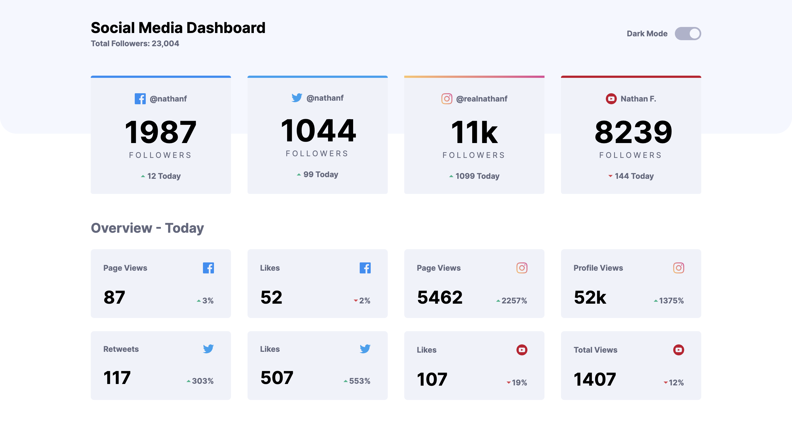
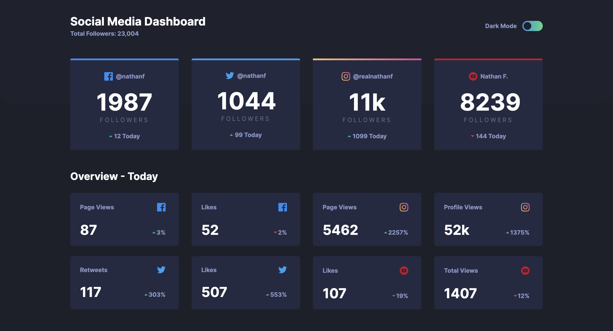

# Social Media Dashboard with Theme Switcher

This project is a solution to the [Social media dashboard with theme switcher challenge](https://www.frontendmentor.io/challenges/social-media-dashboard-with-theme-switcher-6oY8ozp_H) on Frontend Mentor, aimed at improving coding skills by building realistic projects.

## Table of Contents

- [Overview](#overview)
  - [The Challenge](#the-challenge)
  - [Screenshot](#screenshot)
  - [Links](#links)
- [Features](#features)
- [Technologies Used](#technologies-used)
- [What I Learned](#what-i-learned)
- [Continued Development](#continued-development)
- [Acknowledgments](#acknowledgments)
- [Author](#author)

## Overview

### The Challenge

Users should be able to:

- View the optimal layout for the site depending on their device's screen size
- See hover states for all interactive elements on the page
- Toggle color theme to their preference

### Screenshot

### Links

- [GitHub Repo](https://your-solution-url.com)
- [Live Site]()

## Features

- Responsive design for various screen sizes.
- Theme switcher functionality between light and dark themes.
- Hover effects for interactive elements.
- Uses CSS variables for theme colors to facilitate theme switching.

## Technologies Used

- HTML5
- CSS3 (including Flexbox and Grid for layout)
- JavaScript

### What I Learned

- Implementation of CSS custom properties (variables) for theming.
- Manipulating DOM elements with JavaScript to achieve dynamic behaviors like theme switching.
- Enhancing user experience with interactive hover effects and transitions.

### Continued Development
Areas I plan to focus on for future development include:
- Improving accessibility features, such as keyboard navigation and screen reader compatibility.
- Optimizing performance for smoother transitions and faster load times.
- Adding additional features, such as user preferences for theme persistence across sessions.

### Useful resources

- [MDN Web Docs](https://developer.mozilla.org/) - This website provides comprehensive documentation for web technologies and helped me understand JavaScript concepts.
- [CSS-Tricks](https://css-tricks.com/) - This website has a lot of useful articles and tutorials on CSS, which helped me with styling and layout.

## Author

- Website - [My portfolio](https://ayman03-portfolio.netlify.app/)
- Frontend Mentor - [@Aymmaann](https://www.frontendmentor.io/profile/Aymmaann)

## Acknowledgments

I'd like to thank Frontend Mentor for providing such challenging projects to practice my skills. Also, a shoutout to the online coding communities for their support and valuable feedback.
