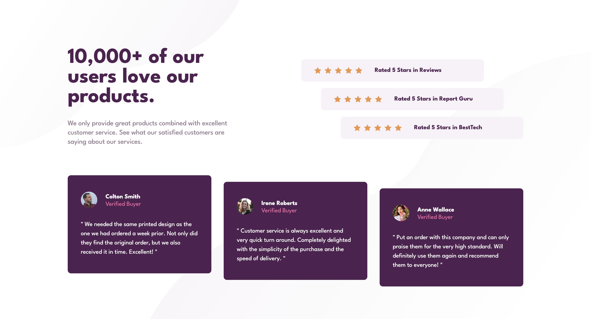

# Social proof section

This is a solution to the [Social proof section challenge on Frontend Mentor](https://www.frontendmentor.io/challenges/social-proof-section-6e0qTv_bA). Frontend Mentor challenges help you improve your coding skills by building realistic projects.

## Table of contents

- [Overview](#overview)
  - [The challenge](#the-challenge)
  - [Screenshot](#screenshot)
  - [Links](#links)
- [My process](#my-process)
  - [Built with](#built-with)
  - [What I learned](#what-i-learned)
  - [Continued development](#continued-development)
- [Author](#author)
- [Acknowledgments](#acknowledgments)

## Overview

### The challenge

Users should be able to:

- View the optimal layout for the section depending on their device's screen size

### Screenshot

### Links

- [GitHub Repo]](https://github.com/Aymmaann/Front-End-Development/tree/main/Social%20proof%20section)
- [Live Site]()

## My process

### Built with

- Semantic HTML5 markup
- CSS custom properties
- Flexbox
- CSS Grid
- Mobile-first workflow

### What I learned
In this project, I learned the importance of semantic HTML markup for better structure and accessibility. CSS custom properties proved invaluable for maintaining consistent styling and enabling easy updates. Flexbox and Grid layouts were instrumental in achieving responsive designs adaptable to various screen sizes. Background images were effectively utilized to enhance visual appeal, while media queries ensured a seamless user experience across devices. Overall, this project provided valuable insights into creating well-structured, responsive web designs.

### Continued development

I want to continue focusing on improving my CSS skills, especially in the areas of layout and responsiveness.

## Author

- Website - [My portfolio](https://ayman03-portfolio.netlify.app/)
- Frontend Mentor - [@Aymmaann](https://www.frontendmentor.io/profile/Aymmaann)

## Acknowledgments

I'd like to thank Frontend Mentor for providing such challenging projects to practice my skills. Also, a shoutout to the online coding communities for their support and valuable feedback.

